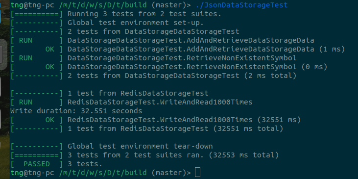
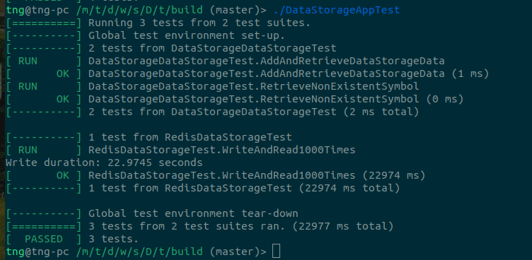

protobuf_json_redis_benchmark

In this tiny project, I want to test the performance of Protobuf vs RapidJSON on the SerDe (serialization/deserialization) problem. RapidJSON, created by Tencent, is known to be the fastest JSON library for parsing JSON data.

My setup is quite simple and straightforward:

Serialization:
The test app --------------> Redis server
             <---------------
             Deserialization

Redis is an in-memory database that features key-value input/output. Although I have plans to add more databases for benchmarking in the future, this is currently a future work item.

As you can see from the code structure, the src/protobuf folder contains the generated files from the Protobuf compiler. RedisDatabase.* contains the source code for reading/writing to the Redis server, using the hiredis/redis++ library. DataStorage_json* contains the source code for reading/writing with RapidJSON. The unit tests are written using Google Test.

============================

UBUNTU setup:
Dependencies:

    Protobuf:
    Building this library using CMake can be a bit tricky. It used to support CMake for building, but now Google is trying to force users to use Bazel. To install Protobuf and its development libraries, run the following command:

sudo apt-get install protobuf-compiler libprotobuf-dev

    Redis:
    To install Redis, run the following commands:

sudo apt install lsb-release curl gpg
curl -fsSL https://packages.redis.io/gpg | sudo gpg --dearmor -o /usr/share/keyrings/redis-archive-keyring.gpg
echo "deb [signed-by=/usr/share/keyrings/redis-archive-keyring.gpg] https://packages.redis.io/deb $(lsb_release -cs) main" | sudo tee /etc/apt/sources.list.d/redis.list
sudo apt-get update
sudo apt-get install redis

    Redis-plus-plus and Hiredis:
    To install Redis-plus-plus and Hiredis, follow these steps:

# Install Hiredis
git clone https://github.com/redis/hiredis.git
cd hiredis
make
sudo make install

# Install Redis-plus-plus
git clone https://github.com/sewenew/redis-plus-plus.git
cd redis-plus-plus
mkdir build
cd build
cmake ..
make -j4
sudo make install
cd ..

    RapidJSON:
    RapidJSON is a header-only library. Simply download the source code and configure it for CMake.

=====================

BUILD on UBUNTU:
Go to the test folder, create a build directory, and build it using the following commands:

cd test && mkdir build && cd build && cmake .. && make

========================

RUNNING TEST:
After the build is complete, run the executable files:

./RedisDBTest
./JsonDataStorageTest
./DataStorageAppTest

=================

RESULT:
It took Protobuf 25 seconds and RapidJSON 32 seconds to serialize a message, write it to Redis, and then deserialize the received message.

